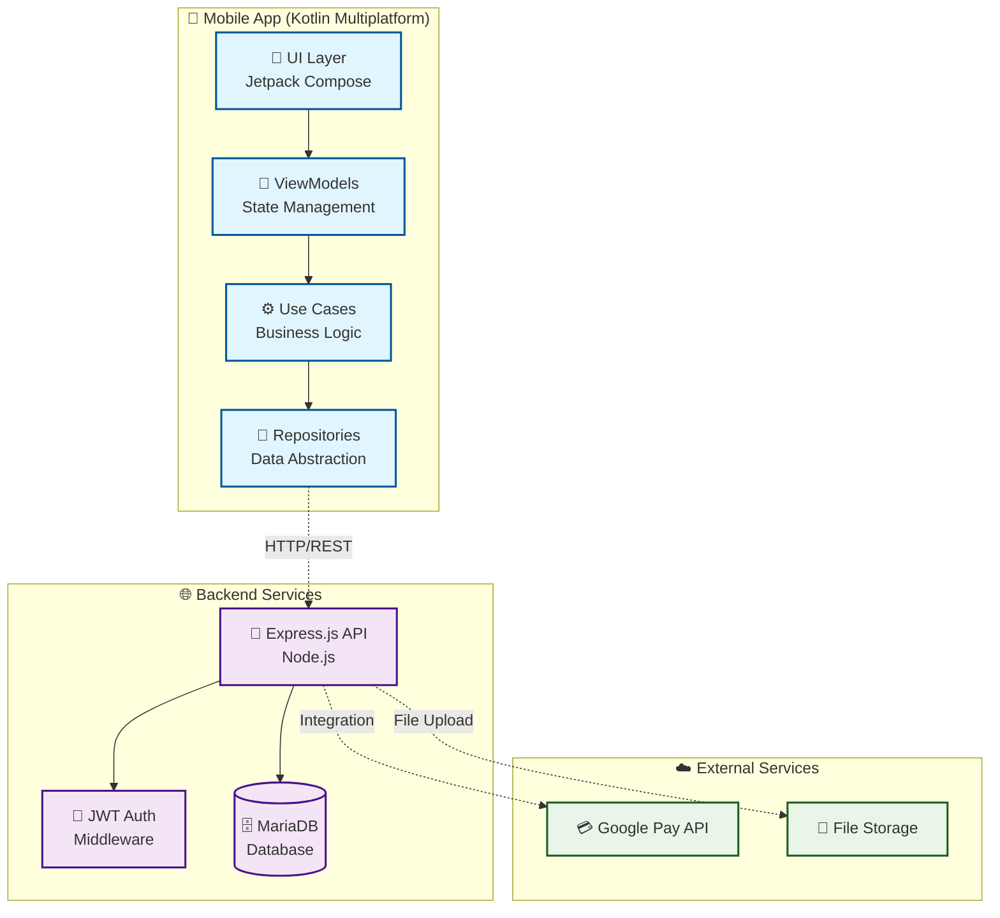
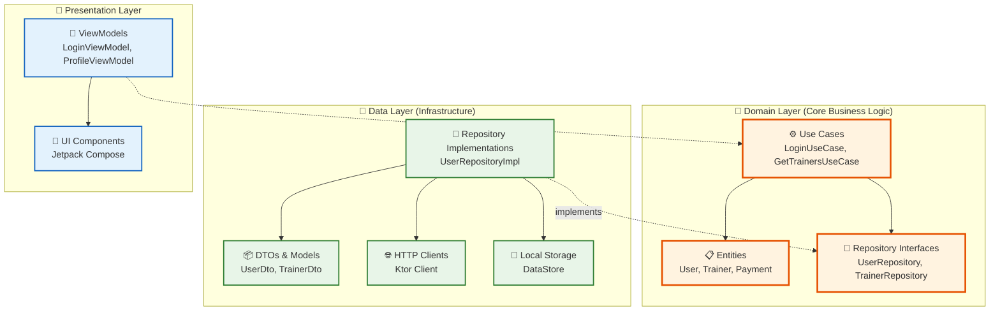
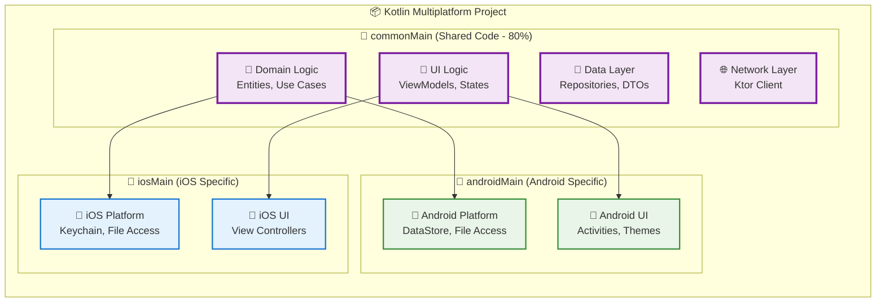
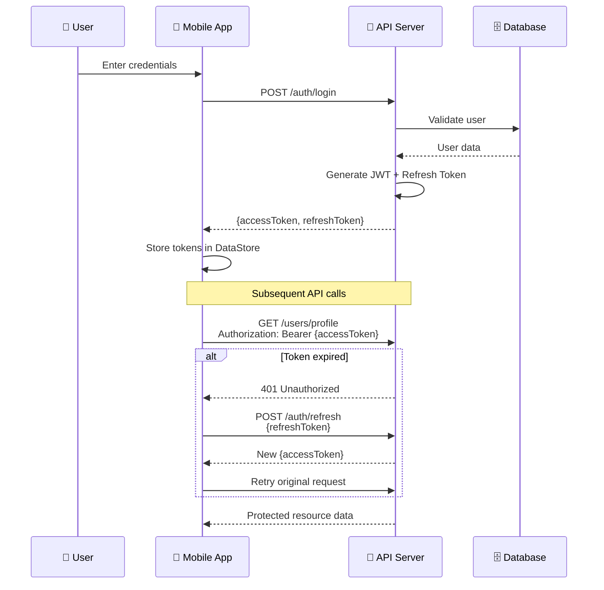
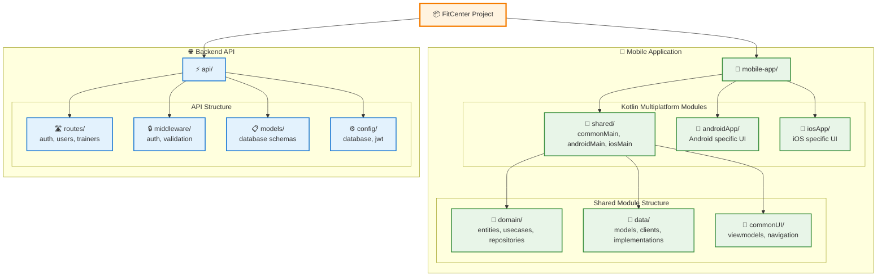

# 🏋️ Human Perform Mobile App

> **Aplicación móvil multiplataforma para gestión integral de centro deportivo**  
> Desarrollada durante prácticas en **Fransdata Tech Ventures** (Mayo - Agosto 2025)


> [!IMPORTANT]
> Todo las caracteristicas de la aplicación móvil aqui mencionadas han sido desarrolladas por mi en su totalidad o gran parte de ellas. El resto de caracteristicas presentes en la aplicación móvil en
> producción son autoría de mis dos compañeros del equipo de desarrollo de la aplicación móvil.

## 📱 Sobre el Proyecto

**Human Perform** es una aplicación móvil multiplataforma desarrollada para un centro deportivo real en Segovia. La app permite a los usuarios gestionar sus entrenamientos, perfiles, favoritos y pagos de manera integral, mientras que el centro puede administrar sus servicios y entrenadores.

**🚀 Estado**: En producción - Utilizada por usuarios reales del centro deportivo

## ✨ Características Principales

### 🔐 **Sistema de Autenticación Completo**
- Registro de usuarios con validación integral
- Login seguro con tokens JWT + refresh tokens
- Autenticación persistente con DataStore cifrado
- Recuperación y cambio de contraseñas
- Cierre de sesión automático por expiración

### 👤 **Gestión de Perfiles Avanzada**
- Carga y edición de imágenes de perfil
- Información personal completa con direcciones
- Configuraciones personalizables
- Eliminación segura de cuentas

### 🏃 **Sistema de Entrenadores**
- Catálogo completo de entrenadores disponibles
- Sistema de favoritos con persistencia

### 🎨 **Experiencia de Usuario Premium**
- Material Design 3 con tema oscuro
- Navegación type-safe moderna
- Feedback visual con snackbars
- Accesibilidad optimizada

## 🏗️ Arquitectura Técnica

### 📋 Visión General del Sistema



### 🎯 Clean Architecture + Hexagonal Architecture

La aplicación implementa **Clean Architecture** con principios de **Arquitectura Hexagonal**, garantizando:

- ✅ **Separación de responsabilidades** clara entre capas
- ✅ **Independencia de frameworks** y tecnologías externas  
- ✅ **Testabilidad** mediante inversión de dependencias
- ✅ **Mantenibilidad** y facilidad de evolución

```
📦 Estructura del Proyecto de la App Móvil
├── 🎯 domain/               # Lógica de Negocio Pura
│   ├── security/            # Modulos para encriptar y guardar en el almacenamiento local
│   ├── repository/          # Interfaces de los repositorios
│   ├── storage/             # Almacenamiento local del dispositivo móvil
│   └── usecases/            # Casos de uso de la aplicación
├── 🔌 data/                # Capa de Infraestructura
│   ├── model/              # DTOs y modelos de datos
│   ├── persistence/        # Implementaciones de repositorios
│   └── network/            # Clientes HTTP (Ktor)
└── 📱 presentation/        # Capa de Presentación
    ├── app/                 # Contiene el punto de entrada de la aplicación, la configuración global de Jetpack Compose y la navegación principal
    │   ├── navigation/      # Arranque y grafo de navegación
    ├── data/                # Capa de datos (implementación)           
    ├── di/                  # Módulo de inyección manual
    ├── ui/                  # Capa de presentación (Compose)
    │   ├── components/      # Composables reutilizables
    │   ├── screens/         # Composables por pantalla
    │   ├── theme/           # Color, Typography, Shapes, Theme
    │   ├── util/            # Helpers de UI (formatters, validators)
    │   └── viewmodel/       # ViewModels + estados/fábricas actuales
    │       └── state/             
    └── worker/              # Tareas en background (WorkManager)

```



### 🤝 Kotlin Multiplatform - Código Compartido

**80% del código compartido** entre Android e iOS usando la estrategia `expect/actual`:



### 🔐 Flujo de Autenticación JWT

Sistema completo con **access tokens** y **refresh tokens** para máxima seguridad:



### 📁 Estructura de Proyecto



### 🔄 Flujo de Datos Unidireccional

```
👆 UI Events → 🧠 ViewModels → ⚙️ Use Cases → 🔌 Repositories → 🌐 API/Database
                    ↓                            ↓                    ↓
📱 UI State Updates ←────────────────────────────┴────────────────────┘
```


## 💡 Decisiones Técnicas Clave

### **¿Por qué Clean Architecture?**
- **Testabilidad**: Cada capa se puede testear independientemente
- **Flexibilidad**: Fácil cambiar de Ktor a Retrofit, o MariaDB a PostgreSQL
- **Escalabilidad**: Agregar nuevas features sin afectar código existente

### **¿Por qué Kotlin Multiplatform?**
- **Eficiencia**: 80% del código reutilizable = menos bugs, menos mantenimiento
- **Consistencia**: Misma lógica de negocio en ambas plataformas
- **Performance**: Compilación nativa, no híbrido como React Native

### **¿Por qué JWT + Refresh Tokens?**
- **Seguridad**: Access tokens de corta duración (15min) + refresh tokens seguros
- **UX**: Login automático sin interrumpir la experiencia del usuario
- **Escalabilidad**: Stateless, fácil de escalar horizontalmente

### **Multiplataforma con Kotlin Multiplatform**
- **`commonMain`**: 80% del código compartido (lógica de negocio, red, datos)
- **`androidMain`**: Implementaciones específicas Android
- **`iosMain`**: Implementaciones específicas iOS
- **`expect/actual`**: Contratos comunes con implementaciones nativas

### **Flujo de Datos Unidireccional**
```
UI Events → Use Cases → Repositories → API/Database → UI State Updates
```

## 🛠️ Stack Tecnológico

### **Frontend Móvil**
- **Kotlin Multiplatform Mobile**: Compartir código entre plataformas
- **Jetpack Compose**: UI moderna y declarativa
- **Navigation Compose**: Navegación type-safe
- **DataStore**: Persistencia cifrada local
- **Ktor Client**: Cliente HTTP multiplataforma

### **Backend API**
- **Node.js + Express.js**: Servidor RESTful
- **MariaDB**: Base de datos relacional
- **JWT**: Autenticación stateless
- **Bcrypt**: Hash seguro de contraseñas

### **Herramientas de Desarrollo**
- **Git**: Control de versiones con branching strategy
- **Clean Code**: Principios SOLID y buenas prácticas
- **IDEs**: WebStorm y Android Studio

## 📊 Métricas del Proyecto

- **+350 horas** de desarrollo
- **14 endpoints** REST implementados
- **2 plataformas** soportadas (Android/iOS, solo he trabajado con Android)
- **5 módulos principales** de funcionalidad
- **80% código compartido** entre plataformas

## 🔗 Endpoints API desarrollados

> \[!NOTE]
> Todos los endpoints protegidos requieren **token JWT** válido vía `verifyToken`.

---

### **Autenticación**

| Método | Ruta                    | Descripción                                                                                                |
| ------ | ----------------------- | ---------------------------------------------------------------------------------------------------------- |
| `POST` | `/auth/register`        | Registro de usuario nuevo con imagen de perfil (`profile_pic`). Procesa y comprime imagen si es necesario. |
| `POST` | `/auth/login`           | Autenticación de usuario y entrega de tokens.                                                              |
| `POST` | `/auth/refresh`         | Renovación de token de acceso.                                                                             |
| `PUT`  | `/auth/change-password` | Cambia la contraseña del usuario autenticado.                                                              |
| `PUT`  | `/auth/reset-password`  | Restablece la contraseña (flujo de recuperación).                                                          |

---

### **Usuarios**

| Método   | Ruta                   | Descripción                                                              |
| -------- | ---------------------- | ------------------------------------------------------------------------ |
| `PUT`    | `/user`                | Actualiza el perfil del usuario (con soporte para nueva foto de perfil). |
| `DELETE` | `/user`                | Elimina la cuenta del usuario autenticado.                               |
| `DELETE` | `/user/photo`          | Elimina la foto de perfil del usuario.                                   |
| `POST`   | `/user/:userId/coupon` | Asigna un cupón a un usuario específico.                                 |
| `GET`    | `/user/:userId/coupon` | Obtiene el cupón asignado a un usuario.                                  |
| `POST`   | `/user/document`       | Sube un documento asociado al usuario (campo `file`).                    |

---

### **Entrenadores**

| Método | Ruta                    | Descripción                                  |
| ------ | ----------------------- | -------------------------------------------- |
| `GET`  | `/list_coaches`         | Lista de entrenadores disponibles.           |
| `POST` | `/user/preferred-coach` | Asigna entrenador preferido.                 |
| `GET`  | `/user/preferred-coach` | Obtiene el entrenador preferido del usuario. |

## 🚀 Instalación y Desarrollo

```bash
# Clonar el repositorio
git clone [repository-url]

# Frontend (Kotlin Multiplatform)
cd mobile-app
./gradlew build

# Backend (Node.js)
cd api
npm install
npm run dev
```

## 🎯 Logros Técnicos Destacados

✅ **Arquitectura Escalable**: Implementación exitosa de Clean + Hexagonal Architecture  
✅ **Multiplataforma Eficiente**: 80% de código reutilizable entre Android e iOS  
✅ **Seguridad Robusta**: Sistema JWT completo con refresh tokens  
✅ **UX Premium**: Material Design 3 con tema oscuro optimizado  
✅ **Producción Real**: Aplicación utilizada por usuarios finales  

## 📝 Aprendizajes Clave

Durante este proyecto de 3 meses adquirí experiencia práctica en:

- Arquitecturas empresariales aplicadas a proyectos reales
- Desarrollo multiplataforma con Kotlin Multiplatform
- Diseño e implementación de APIs RESTful seguras
- Gestión de estado y navegación en aplicaciones móviles
- Trabajo en equipo
- Resolución de problemas críticos en producción

---

⭐ **¿Te gustó el proyecto?** ¡Dale una estrella al repositorio!
